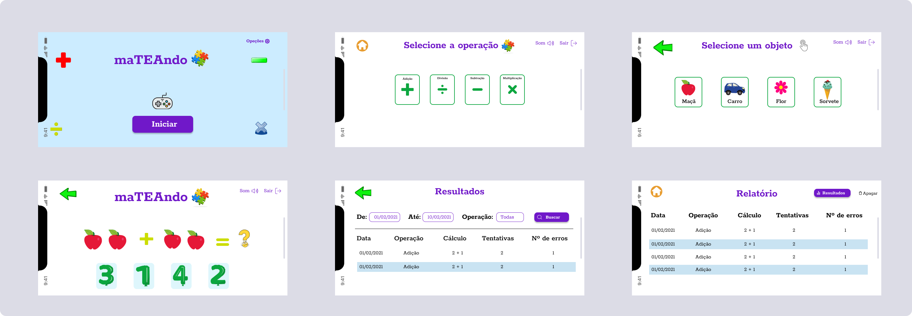

<h1 align="center">
  
</h1>

<h1 align="center">
  
</h1>


<h4 align="center"> 
	🚧  maTEAndo 🚀 em desenvolvimento 🚧
</h4>

<br/>

<p align="center">
 <a href="#sobre-o-projeto">Sobre o projeto</a> • 
 <a href="#funcionalidades">Funcionalidades</a> • 
 <a href="#layout">Layout</a> • 
 <a href="#como-executar-o-projeto">Como executar o projeto</a> • 
 <a href="#tecnologias">Tecnologias</a> • 
 <a href="#contribuidores">Contribuidores</a> • 
 <a href="#autor">Autor</a> • 
<a href="#licenc-a">Licença</a> • 
</p>
<br/>

## Sobre o projeto

<p align="left"><strong> maTEAndo </strong>  é o meu projeto de TCC do curso de Licenciatura em Ciências da Computação, no Instituto Federal Baiano, Campus, Senhor do Bonfim - BA.</br>
Objetivo do maTEAndo é <strong> auxiliar no processo de aprendizagem das quatro operações básicas de matemática para crianças com autismo - TEA  </strong> , dai veio a origem do nome, a junção de matemática com TEA.
</br> O desenvolvimento do jogo contou com ajuda de professores que atuam no Atendimento Educacional Especializado - AEE, com a finalidade de atender as particularidades do autismo. Dessa forma, foi utilizado cores neutras, animações simples e imagens de objetos do dia a dia das crianças.</br>
O jogo permite também que os pais/responsáveis possam acompanhar o progresso do seu/sua filho (a) através de um relatório.
Pensando nas condições socioeconômica de muitas pessoas, o jogo foi desenvolvido para versão mobile e não necessita de internet durante a utilização do jogo.
</p>

<br/>

##  Funcionalidades

- [x] Gerar operações matemáticas.
- [x] Salvar os dados localmente.
- [x] Gerar relatório;
 
---

## Layout
Você pode acessar o Layout pelo Figma através <a href="https://www.figma.com/file/krA811HxpnvpxYAaGtgOGU/projeto-gamer-TEA?node-id=863%3A1404">desse link</a>.

<br/>

---

## Como executar o projeto

### Pré-requisitos

Antes de começar, você vai precisar ter instalado em sua máquina as seguintes ferramentas:
[Git](https://git-scm.com) é um editor para trabalhar com o código como [VSCode](https://code.visualstudio.com/)

#### 🎲 Rodando o projeto

```bash

# Clone este repositório
$ git clone git@github.com:andersonzeroone/maTEAndoMobile.git

# Acesse a pasta do projeto no terminal/cmd
$ cd maTEAndoMobile

# Instale as dependências
$ npm install ou yarn install

# Execute a aplicação
$ expo start

# O projeto iniciará na porta:3333 - acesse http://localhost:3333 
```

---
##  Tecnologias

As seguintes ferramentas foram usadas na construção do projeto:

#### **Mobile**  ([React Native](http://www.reactnative.com/)  +  [TypeScript](https://www.typescriptlang.org/))

-   **[Expo](https://expo.io/)**
-   **[Expo Google Fonts](https://github.com/expo/google-fonts)**
-   **[React Navigation](https://reactnavigation.org/)**
-   **[Expo local storage](https://docs.expo.dev/versions/latest/sdk/async-storage/)**

> Veja o arquivo  [package.json](https://github.com/andersonzeroone/maTEAndoMobile/blob/main/package.json)

**Utilitários**

-   Protótipo:  **[Figma](https://www.figma.com/)**  →  **[Protótipo (maTEAndo)](https://www.figma.com/file/krA811HxpnvpxYAaGtgOGU/projeto-gamer-TEA?node-id=863%3A1404)**

-   Editor:  **[Visual Studio Code](https://code.visualstudio.com/)**  


---
## Contribuidores

💜 Um super thanks 👏 para essa galera que fez esse produto sair do campo da ideia e entrar nas lojas de aplicativos :)

## Como contribuir para o projeto

1. Faça um **fork** do projeto.
2. Crie uma nova branch com as suas alterações: `git checkout -b my-feature`
3. Salve as alterações e crie uma mensagem de commit contando o que você fez: `git commit -m "feature: My new feature"`
4. Envie as suas alterações: `git push origin my-feature`
> Caso tenha alguma dúvida confira este [guia de como contribuir no GitHub](./CONTRIBUTING.md)

---

##  Autor
</br>

<a href="https://github.com/andersonzeroone">
 
 <br />
 <br />
 <sub><b>Anderson Pablo</b></sub></a> <a href="https://www.linkedin.com/in/anderson-pablo-js/" title="andersonPablo">🚀</a>
 <br />


 [](https://www.linkedin.com/in/anderson-pablo-js/) 
[](mailto:anderson.pablo02@gmail.com)

---

## Licença

Este projeto está sob a licença [MIT](./LICENSE).

Feito com ❤️ por Anderson Pablo 👋🏽 [Entre em contato!](https://www.linkedin.com/in/anderson-pablo-js/)

---

<!-- ##  Versões do README

[Português 🇧🇷](./README.md)  |  [Inglês sem emojis 🇺🇸](./README-en.md) | [Portugues sem logo  🇧🇷](./README-sem-logo.md)  -->